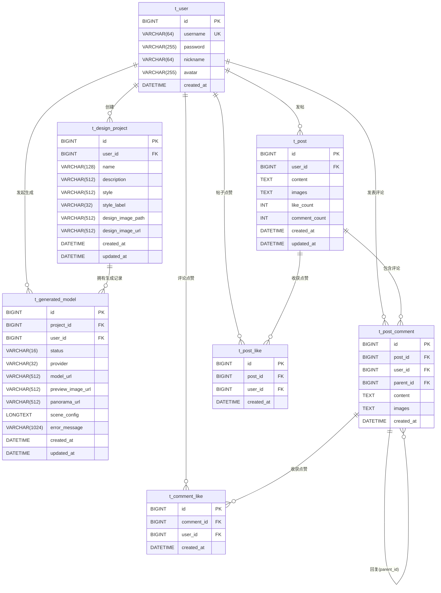

# 筑梦家 · 数据库设计

> 基于 MyBatis-Plus 实体（`com.housedesign.entity`）与 `backend/src/main/resources/db/house_design.sql` 整理，数据库使用 MySQL 8。
> 关联均为**逻辑外键**（实体只存 `Long` 字段，无数据库级外键约束），由应用层保证完整性。
> 建表脚本为 `house_design.sql`（`CREATE TABLE IF NOT EXISTS`）；**已存在的表不会自动加列**，表结构变更需手动执行 ALTER（见 §2 迁移说明）。

---

## 表结构总览

| 表名 | 实体 | 说明 |
| --- | --- | --- |
| `t_user` | User | 用户 |
| `t_design_project` | DesignProject | 设计项目（一张设计图 = 一个项目） |
| `t_generated_model` | GeneratedModel | AI 生成任务与结果 |
| `t_post` | Post | 装修小圈帖子 |
| `t_post_comment` | PostComment | 帖子评论（两级：parent_id 支持楼中楼） |
| `t_post_like` | PostLike | 帖子点赞 |
| `t_comment_like` | CommentLike | 评论点赞（独立于帖子点赞） |

---

## 1. `t_user` — 用户表

| 字段 | 类型 | 约束 | 说明 |
| --- | --- | --- | --- |
| `id` | BIGINT | PK，自增 | 用户 ID |
| `username` | VARCHAR(64) | NOT NULL，**UNIQUE** | 用户名 |
| `password` | VARCHAR(255) | NOT NULL | BCrypt 加密存储 |
| `nickname` | VARCHAR(64) | | 昵称，默认为 username |
| `avatar` | VARCHAR(255) | | 头像 URL |
| `created_at` | DATETIME | NOT NULL | 创建时间（不可更新） |

## 2. `t_design_project` — 设计项目表

| 字段 | 类型 | 约束 | 说明 |
| --- | --- | --- | --- |
| `id` | BIGINT | PK，自增 | 项目 ID |
| `user_id` | BIGINT | NOT NULL | 归属用户（逻辑外键 → `t_user.id`） |
| `name` | VARCHAR(128) | NOT NULL | 项目名称 |
| `description` | VARCHAR(512) | | 项目描述 |
| `style` | VARCHAR(512) | | 用户自定义风格要求（自由文本，如「原木色、温馨、多绿植」），与 `style_label` 至少填一个 |
| `style_label` | VARCHAR(32) | | 预设风格 code（见 `DesignStyle` 枚举），与 `style` 至少填一个 |
| `design_image_path` | VARCHAR(512) | | 设计图相对路径（storage 下） |
| `design_image_url` | VARCHAR(512) | | 设计图可访问 URL |
| `created_at` | DATETIME | NOT NULL | 创建时间 |
| `updated_at` | DATETIME | NOT NULL | 更新时间 |

> **注意**：若库中已有旧表（原 `style VARCHAR(32)` 无 `style_label`），需手动执行迁移：
>
> ```sql
> ALTER TABLE t_design_project
>     MODIFY COLUMN `style` VARCHAR(512) DEFAULT NULL COMMENT '用户自定义风格要求（自由文本）',
>     ADD COLUMN `style_label` VARCHAR(32) DEFAULT NULL COMMENT '预设风格 code（DesignStyle）' AFTER `style`;
> ```

## 3. `t_generated_model` — 生成任务表

| 字段 | 类型 | 约束 | 说明 |
| --- | --- | --- | --- |
| `id` | BIGINT | PK，自增 | 任务 ID |
| `project_id` | BIGINT | NOT NULL | 所属项目（逻辑外键 → `t_design_project.id`） |
| `user_id` | BIGINT | NOT NULL | 发起用户（逻辑外键 → `t_user.id`） |
| `status` | VARCHAR(16) | NOT NULL | 枚举字符串：`PENDING`/`PROCESSING`/`SUCCESS`/`FAILED` |
| `provider` | VARCHAR(32) | | AI 提供方（当前实现固定为 `zhipu`，不设 mock） |
| `model_url` | VARCHAR(512) | | 3D 模型（glb/gltf）URL |
| `preview_image_url` | VARCHAR(512) | | 预览缩略图 URL |
| `panorama_url` | VARCHAR(512) | | 全景图 URL（智谱出图时填充） |
| `scene_config` | LONGTEXT | | 3D 场景 JSON（`@Lob`，程序化渲染用） |
| `error_message` | VARCHAR(1024) | | 失败原因 |
| `created_at` | DATETIME | NOT NULL | 创建时间 |
| `updated_at` | DATETIME | NOT NULL | 更新时间 |

## 4. `t_post` — 帖子表

| 字段 | 类型 | 约束 | 说明 |
| --- | --- | --- | --- |
| `id` | BIGINT | PK，自增 | 帖子 ID |
| `user_id` | BIGINT | NOT NULL | 作者（逻辑外键 → `t_user.id`） |
| `content` | TEXT | | 帖子正文 |
| `images` | TEXT | | 图片 URL 列表，**JSON 字符串**存储（`StringListConverter` ↔ `List<String>`） |
| `like_count` | INT | NOT NULL，默认 0 | 点赞数（**冗余计数器**） |
| `comment_count` | INT | NOT NULL，默认 0 | 评论数（**冗余计数器**） |
| `created_at` | DATETIME | NOT NULL | 创建时间 |
| `updated_at` | DATETIME | NOT NULL | 更新时间 |

## 5. `t_post_comment` — 评论表

| 字段 | 类型 | 约束 | 说明 |
| --- | --- | --- | --- |
| `id` | BIGINT | PK，自增 | 评论 ID |
| `post_id` | BIGINT | NOT NULL | 所属帖子（逻辑外键 → `t_post.id`） |
| `user_id` | BIGINT | NOT NULL | 评论者（逻辑外键 → `t_user.id`） |
| `parent_id` | BIGINT | | 被回复的评论 ID（NULL=顶层评论；非NULL=该评论的回复，两级楼中楼） |
| `content` | TEXT | | 评论文字（与 images 至少填一个） |
| `images` | TEXT | | 评论图片 URL 列表，**JSON 字符串**存储 |
| `created_at` | DATETIME | NOT NULL | 创建时间 |

> 索引：`idx_post_id`、`idx_user_id`、`idx_parent_id`。
> 两级结构：`parent_id = NULL` 为顶层评论；非 NULL 指向被回复评论，回复的 `post_id` 沿用父评论所属帖子。

## 6. `t_post_like` — 帖子点赞表

| 字段 | 类型 | 约束 | 说明 |
| --- | --- | --- | --- |
| `id` | BIGINT | PK，自增 | 主键 |
| `post_id` | BIGINT | NOT NULL | 被赞帖子（逻辑外键 → `t_post.id`） |
| `user_id` | BIGINT | NOT NULL | 点赞用户（逻辑外键 → `t_user.id`） |
| `created_at` | DATETIME | NOT NULL | 点赞时间 |

> **唯一约束**：`UNIQUE(post_id, user_id)` — 保证同一用户对同一帖子只能点赞一次（配合切换式点赞接口实现"点赞/取消赞"）。

## 7. `t_comment_like` — 评论点赞表

| 字段 | 类型 | 约束 | 说明 |
| --- | --- | --- | --- |
| `id` | BIGINT | PK，自增 | 主键 |
| `comment_id` | BIGINT | NOT NULL | 被赞评论（逻辑外键 → `t_post_comment.id`） |
| `user_id` | BIGINT | NOT NULL | 点赞用户（逻辑外键 → `t_user.id`） |
| `created_at` | DATETIME | NOT NULL | 点赞时间 |

> **唯一约束**：`UNIQUE(comment_id, user_id)` — 同一用户对同一评论只能点赞一次。
> 独立于帖子点赞表（帖子点赞操作不影响评论点赞，反之亦然）。

---

## ER 图



---

## 设计特征与注意事项

1. **全部为逻辑外键，无数据库级外键约束**  
   实体只存 `userId` / `projectId` / `postId` 等 `Long` 字段，未使用外键约束（MyBatis-Plus 实体，非 JPA `@ManyToOne`）。数据库不会阻止脏数据，完整性由应用层（`UserContext.getUserId()` 归属校验）保证。  
   → 风险：删除用户后，其名下项目 / 帖子会成为孤儿数据；删除项目不会级联清理生成记录与社区引用。

2. **冗余计数器**  
   `t_post.like_count` / `comment_count` 为列表页避免 `COUNT(*)` 而设，需与 `t_post_like` / `t_post_comment` 的真实数量保持同步（写入路径上用事务保证），否则会出现计数不一致。

3. **`images` 列为 JSON 字符串**  
   存图片 URL 列表的 JSON 字符串（MyBatis-Plus 侧用 TypeHandler 或手动序列化在 `List<String>` 与 TEXT 间转换），无法用 SQL 直接查询筛选单张图片。

4. **`scene_config` 为 LONGTEXT**  
   存整段 3D 场景 JSON，数据量大时明显撑大表体积。

5. **`status` 用字符串枚举存储**  
   存 `PENDING` 等字面量，可读性好且新增枚举值安全；代码侧用 `GenerationStatus` 枚举常量对应（MyBatis-Plus 枚举映射）。

6. **`style` 与 `style_label` 双字段**  
   `style` 存用户自由文本（长度可能较长，故 VARCHAR(512)），`style_label` 存枚举 code（VARCHAR(32)），二者**至少填一个**，由应用层校验；`style_label` 便于聚合统计"哪种风格最受欢迎"。

7. **帖子与评论点赞分离**  
   帖子点赞在 `t_post_like`、评论点赞在 `t_comment_like`，互不干扰；两者均以 `UNIQUE(目标id, user_id)` 防重复，配合切换式接口实现"赞/取消赞"。

8. **评论两级结构**  
   `t_post_comment.parent_id` 实现楼中楼：NULL 为顶层评论，非 NULL 为回复（`post_id` 沿用父评论所属帖子）；删除帖子时按 `post_id` 级联删除评论与两种点赞（应用层事务保证）。

---

## 上线前建议加固项

- 软删除（标记 `deleted` 而非物理删除）以避免孤儿数据。
- 删除用户 / 项目时级联清理或置空关联资源。
- 确保 `like_count` / `comment_count` 在写入路径上严格同步。
- 如查询图片 / 场景 JSON 频繁，考虑拆表或改用 JSON 类型列。
